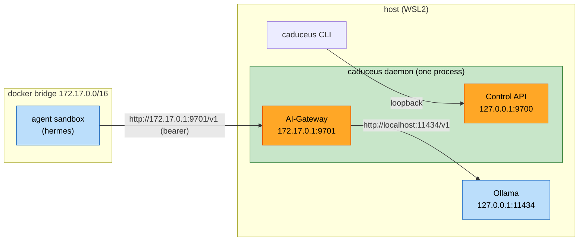

# U1 AI-Gateway — Deployment Architecture (local)

## Runtime placement

Text alternative: On the host, the caduceus daemon runs one process with two listeners — Control API on 127.0.0.1:9700 (CLI only) and AI-Gateway on the docker bridge IP 172.17.0.1:9701 (reachable from sandboxes). An agent sandbox on the docker bridge calls the AI-Gateway at `http://172.17.0.1:9701/v1` with its bearer token; the AI-Gateway forwards to Ollama at `http://localhost:11434/v1`.

## Lifecycle
- `caduceus gateway start` → acquire `~/.caduceus` lock → detect bridge gw IP → bind both listeners → ready.
- `caduceus gateway status` → pid/uptime, listeners, upstream health, agent count, counters.
- `caduceus gateway stop` → graceful shutdown (drain streams, stop Supervisor, release lock).

## Failure modes (U1)
| Failure | Behavior |
|---|---|
| Upstream (Ollama) down | `/v1/*` → 502; `/v1/models` → minimal `[default]`; daemon stays up |
| Bridge IP undetectable | fall back to `host.docker.internal` advertise + `--add-host` (U2), or configured override |
| Port 9701 in use | startup error with remediation hint (configurable port) |

## Validation hooks (Build & Test)
- Integration: bring up daemon, hit AI-Gateway from a real sandbox, assert streamed completion via Ollama.
- Fault-injection (RESILIENCY-14): stop upstream, assert 502 + daemon liveness (AC-4).
