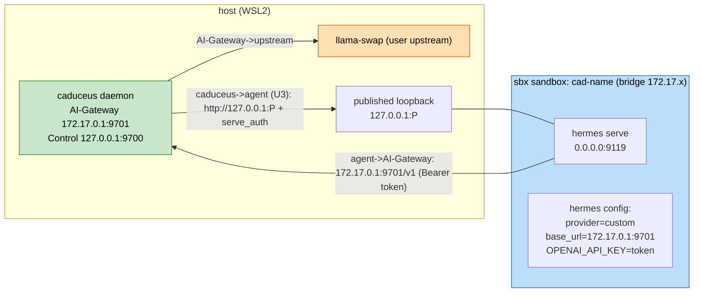

# U2 — Deployment Architecture (per-agent runtime)

## Per-agent runtime

Text alternative: Each agent is a `sbx` sandbox `cad-<name>` on the docker bridge running `hermes serve` on `0.0.0.0:9119`, published to a host loopback port `P`. caduceus (U3 transport) reaches the agent at `http://127.0.0.1:P` using the stored serve credential. The agent's hermes is configured with provider base_url = `172.17.0.1:9701/v1` and `OPENAI_API_KEY=<token>`, so its LLM calls go to the caduceus AI-Gateway (bearer-authenticated), which forwards to the user's upstream.

## create / teardown lifecycle
- **create**: ensure image → create sandbox → cp config + env → start serve → publish port → register → health.
- **stop/start**: `sbx stop|start cad-<name>` (local only; remote N/A per BR-A10).
- **rm**: `sbx rm cad-<name>` + de-register.

## Failure modes
| Failure | Behavior |
|---|---|
| image build fails | create aborts before sandbox; clear error |
| sandbox/serve start fails | saga compensation: `sbx rm`; token discarded; not persisted |
| published port unreachable at health | mark agent unhealthy; keep record; surfaced in `ls` |
| agent → AI-Gateway 401 | misconfigured token/env; flagged in deep health |

## Build & Test hooks
- Integration: build `caduceus/hermes:0.17.0`, provision a real agent, assert serve reachable + an end-to-end completion via AI-Gateway→upstream.
- RESILIENCY-14 fault injection: kill upstream / stop sandbox; assert graceful degradation + daemon liveness.
