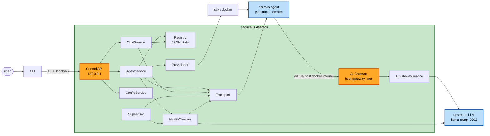

# Component Dependencies — Caduceus

## Dependency matrix (row depends on column)

| Component \ depends on | ControlAPIClient | ControlAPI | AgentService | ChatService | ConfigService | AIGatewayService | Registry | Provisioner | ImageBuilder | Transport | UpstreamClient | HealthChecker | ConfigEditor | Supervisor | Config |
|---|---|---|---|---|---|---|---|---|---|---|---|---|---|---|---|
| CLI | ✔ | | | | | | | | | | | | | | |
| ControlAPIClient | | ✔(HTTP) | | | | | | | | | | | | | |
| ControlAPI | | | ✔ | ✔ | ✔ | | | | | | | ✔ | | | |
| AIGateway | | | | | | ✔ | | | | | | | | | |
| AgentService | | | | | | | ✔ | ✔ | ✔ | ✔ | | ✔ | | | ✔ |
| ChatService | | | | | | | ✔ | | | ✔ | | ✔ | | | |
| ConfigService | | | | | | | ✔ | | | ✔ | | | ✔ | | |
| AIGatewayService | | | | | | | ✔ | | | | ✔ | | | | ✔ |
| Provisioner | | | | | | | | | | | | | | | ✔ |
| Transport/ServeTransport | | | | | | | | | | | | | | | ✔ |
| HealthChecker | | | | | | | | | | ✔ | ✔ | | | | |
| ConfigEditor | | | | | | | | ✔ | | | | | | | |
| Supervisor | | | ✔ | | | | ✔ | ✔ | | ✔ | | ✔ | | | |
| Daemon/GatewayService | | ✔(hosts) | ✔ | ✔ | ✔ | ✔ | ✔ | ✔ | | | | | | ✔ | ✔ |

Notes: Logging is used by all (omitted for brevity). Config is read by most adapters (only the principal users are marked).

---

## Communication patterns

| Edge | Mechanism |
|---|---|
| CLI ↔ Daemon (Control API) | HTTP/JSON + SSE over **loopback** (Q1=A) |
| Agent (hermes) → AI-Gateway | HTTP/OpenAI over `host.docker.internal` (Q3=A) |
| Caduceus ↔ Agent (Transport) | `hermes serve` JSON-RPC/WebSocket (local published port via `sbx ports`, or remote URL) |
| Provisioner ↔ sandbox | `sbx` CLI subprocess (`create/exec/cp/ports/ls/stop/rm`) |
| AIGatewayService → Upstream | HTTP/OpenAI to llama-swap (`localhost:9292/v1`) |
| Registry ↔ disk | JSON file, atomic write (temp + `os.replace`) |

---

## Component / data-flow diagram

Text alternative (data flow): The user runs the CLI, which calls the Control API over loopback. The Control API delegates to AgentService / ChatService / ConfigService. AgentService uses the Provisioner (which drives sbx/docker to create the agent sandbox), the Registry (JSON state), the Transport, and the HealthChecker. ChatService uses the Transport (to the hermes agent) and the Registry (session id). The hermes agent makes its LLM calls to the AI-Gateway via `host.docker.internal`; AIGatewayService forwards them to the upstream LLM (llama-swap). The Supervisor and HealthChecker periodically probe transports and the upstream.

---

## Dependency cycles & layering
- No cycles: CLI → Control API → Services → Adapters → external. AI-Gateway → AIGatewayService → UpstreamClient is a separate inbound path (from agents), not a cycle with the control path.
- The Transport abstraction isolates hermes-protocol specifics so a future `AcpTransport` (local optimization) drops in without touching services.

## Unit dependency order (for Units Generation)
- **U1 (AI-Gateway)** — independent; can be built/tested first (agents not required: testable with a stub upstream).
- **U2 (Registry & Provisioner)** — depends conceptually on U1 (agents are configured to point at the AI-Gateway URL) but buildable in parallel with a placeholder URL.
- **U3 (Transport & Chat)** — depends on U2 (needs provisioned agents) + Transport.
- **U4 (CLI, Daemon, Config)** — depends on U1+U2+U3 (composition root + user surface).

Recommended build sequence: **U1 → U2 → U3 → U4** (with U1/U2 parallelizable).
