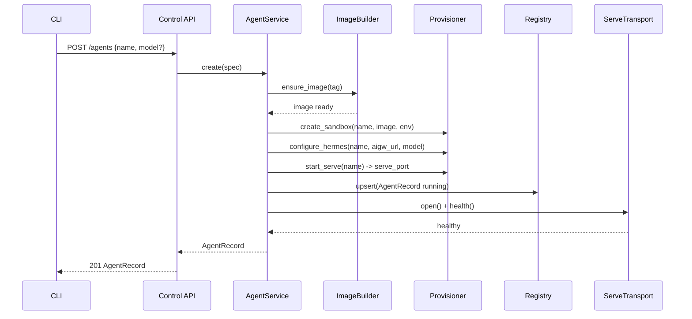
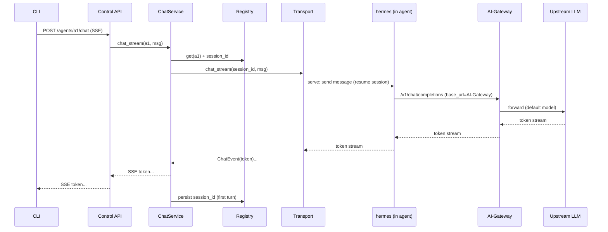
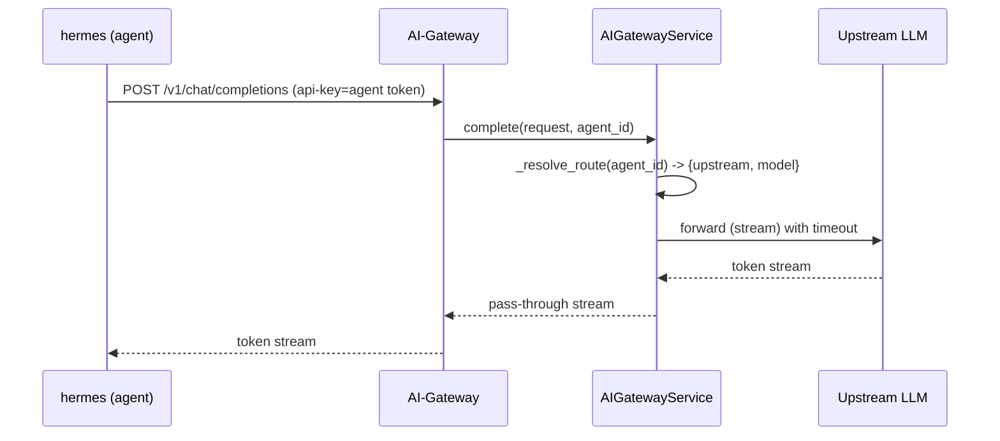

# Services & Orchestration — Caduceus

Service layer = orchestration over components. Five services live in the daemon.

| Service | Responsibility | Key collaborators |
|---|---|---|
| **Daemon/GatewayService** | process lifecycle; hosts Control API + AI-Gateway listeners; owns singletons; starts Supervisor | Config, Registry, Provisioner, Supervisor, ControlAPI, AIGateway |
| **AgentService** | agent lifecycle (create/register/ls/rm/stop/start) | ImageBuilder, Provisioner, Registry, Transport, HealthChecker |
| **ChatService** | streaming chat + session continuity | Registry, Transport, HealthChecker |
| **ConfigService** | read/edit agent config | ConfigEditor, Registry, Transport |
| **AIGatewayService** | OpenAI-compatible proxy + upstream routing | UpstreamClient, Registry, Config |

Cross-cutting: **Supervisor** (resiliency), **HealthChecker**, **Logging**, **Config**.

---

## Two listeners (Q3=A — control/data plane split)

- **Control API**: bind `127.0.0.1:<control_port>` (or Unix socket fallback). CLI-only.
- **AI-Gateway**: bind container-reachable interface so sandboxes reach it at `http://host.docker.internal:<aigw_port>/v1`. Carries only OpenAI traffic from agents.

---

## Orchestration — `agent create` (managed/local)

Text alternative: CLI POSTs to Control API; AgentService ensures the hermes image, creates the sandbox, configures hermes to use the AI-Gateway as provider, starts `hermes serve` and publishes its port, records the agent in the Registry, then verifies health through ServeTransport before returning.

**Failure handling**: any step failure → rollback (best-effort sandbox teardown), record nothing or mark `failed`, return a clear error (graceful — daemon stays up).

---

## Orchestration — `agent chat` (streaming, session-persistent)

Text alternative: chat streams CLI→ControlAPI→ChatService→Transport→hermes. hermes performs the LLM call against the AI-Gateway (its configured provider), which forwards to the upstream LLM; tokens stream back along the same path. ChatService persists the hermes session id on the first turn so subsequent chats resume (Q4=A). If the agent or upstream is down, the stream yields a single `error` event and closes; the daemon stays healthy.

---

## Orchestration — AI-Gateway request (agent → caduceus → LLM)

Text alternative: the agent's hermes calls the AI-Gateway's OpenAI endpoint; AIGatewayService resolves the route (default upstream + default model now; per-agent override in v2), forwards with explicit timeouts, and streams the response straight back.

---

## Resiliency orchestration (Supervisor — RES-4/RES-5)
- Periodic sweep: `HealthChecker.check(name, deep)` for each agent + `check_upstream()`.
- On dropped transport → reconnect (bounded retries, exponential back-off).
- On unhealthy managed agent → attempt `Provisioner.start_serve` restart; if it keeps failing → **circuit-break** (mark `unhealthy`, stop retrying until next manual action / longer back-off).
- All external calls (Provisioner/sbx, Transport, UpstreamClient) use **explicit timeouts** (RESILIENCY-10); a single agent's failure never crashes the daemon (graceful degradation).

## Service boundaries vs Units
- **U1**: AIGatewayService (+ AIGateway, UpstreamClient)
- **U2**: AgentService (+ Provisioner, ImageBuilder, Registry, HealthChecker)
- **U3**: ChatService (+ Transport/ServeTransport, Supervisor)
- **U4**: Daemon/GatewayService, ConfigService (+ CLI, ControlAPI, ConfigEditor, Logging)
