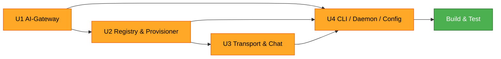

# Unit Dependency Matrix — Caduceus

## Dependency matrix (row depends on column)

| Unit \ on | U1 AI-Gateway | U2 Registry/Provisioner | U3 Transport/Chat | U4 CLI/Daemon/Config |
|---|---|---|---|---|
| **U1 AI-Gateway** | — | no | no | no |
| **U2 Registry/Provisioner** | soft (AI-Gateway URL to configure agents; injectable) | — | no | no |
| **U3 Transport/Chat** | no | yes (Registry + provisioned agents) | — | no |
| **U4 CLI/Daemon/Config** | yes (mounts AIGatewayService) | yes (AgentService) | yes (ChatService, Transport, Supervisor) | — |

Legend: **yes** = hard build/runtime dependency; **soft** = needs a value/interface that can be injected (placeholder during isolated build); **no** = none.

---

## Build & integration order

Text alternative: Build U1 first (independent). U2 next (soft dependency on U1's AI-Gateway URL, injectable). U3 after U2 (needs the registry + agents). U4 last (composition root depending on U1, U2, U3). Build & Test runs after U4.

- **Recommended sequence**: U1 → U2 → U3 → U4 → Build & Test.
- **Parallelization**: U1 and U2 can be developed in parallel (U2 uses an injected AI-Gateway URL); U3 and U4 are sequential after their deps.
- **Integration checkpoints**: after U2 (agent provisioned + healthy via direct Transport probe); after U3 (end-to-end chat against a real agent); after U4 (full CLI→daemon→agent→AI-Gateway→upstream path).

---

## Inter-unit interface contracts (to honor during Construction)

| Provider → Consumer | Contract |
|---|---|
| U1 → U4 | `AIGatewayService` ASGI app/router mountable by the daemon; config: bind iface/port |
| U1 → U2 | AI-Gateway URL string (`http://host.docker.internal:<port>/v1`) used to configure agent hermes provider |
| U2 → U3 | `Registry.get(name) -> AgentRecord`; `AgentRecord` carries endpoint/port/session_id/kind |
| U2 → U4 | `AgentService` (create/register/list/remove/stop/start) |
| U3 → U4 | `ChatService.chat_stream(name, msg) -> AsyncIterator[ChatEvent]`; `Supervisor.start/stop` |
| U2/U3 → U4 | `HealthChecker.check()` results surfaced by `agent ls` |

Stable data model `AgentRecord` (owned by U2, in `common/` models) is the primary cross-unit contract; changes to it require updating consumers U3/U4.
