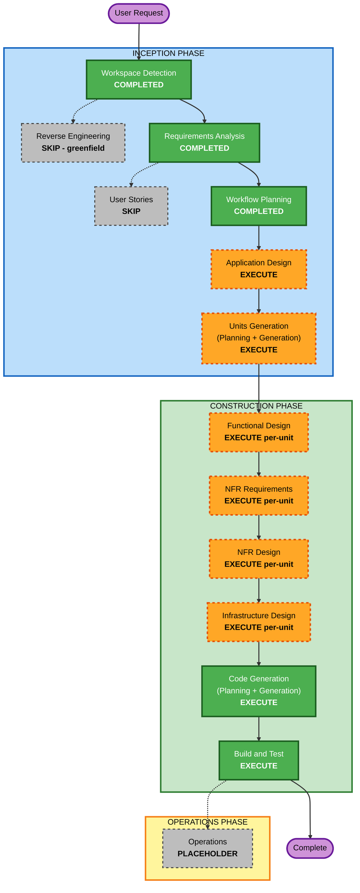

# Execution Plan — Caduceus

**Date**: 2026-06-29
**Project type**: Greenfield, local-first developer tool (Complex)

---

## Detailed Analysis Summary

### Change Impact Assessment
- **User-facing changes**: Yes — `caduceus` CLI (agent create/register/ls/chat/config/logs/stop/start; gateway start/stop/status) with streaming chat UX.
- **Structural changes**: Yes — new system architecture: gateway daemon, AI-Gateway (LLM proxy), transport abstraction, agent registry/state, sbx provisioner.
- **Data model changes**: Yes — agent registry + state schema, agent→session mapping, per-agent settings, hermes config representation.
- **API changes**: Yes — OpenAI-compatible AI-Gateway API (`/v1/chat/completions` streaming, `/v1/models`), CLI↔daemon control API, hermes serve transport protocol.
- **NFR impact**: Yes — resiliency (health/timeouts/graceful degradation/process supervision), observability (structured logging), performance (streaming pass-through), portability (Docker/WSL2).

### Risk Assessment
- **Risk Level**: Medium — greenfield and locally isolated (no production blast radius), but multiple external integration points (Docker, `sbx`, `hermes serve`/config, `host.docker.internal` networking) carry real unknowns to validate.
- **Rollback Complexity**: Easy — local tool; version-pinned reinstall; sandboxes are disposable.
- **Testing Complexity**: Moderate-to-Complex — integration with Docker/sbx/hermes + property-based tests (Hypothesis) + streaming.

### Key Integration Risks (to retire early in Construction)
1. hermes image build + `sbx create shell -t <image>` provisioning.
2. `host.docker.internal:<port>` reachability from sandbox → caduceus AI-Gateway (WSL2/Docker).
3. `hermes serve` auth + publishing the serve port to loopback via `sbx ports`.
4. Configuring hermes `custom_providers.base_url` to the AI-Gateway, programmatically.

---

## Workflow Visualization

### Text Alternative (workflow)
- INCEPTION: Workspace Detection (COMPLETED) → Reverse Engineering (SKIP, greenfield) / Requirements Analysis (COMPLETED) → User Stories (SKIP) / Workflow Planning (COMPLETED) → Application Design (EXECUTE) → Units Generation (EXECUTE).
- CONSTRUCTION (per-unit loop): Functional Design → NFR Requirements → NFR Design → Infrastructure Design → Code Generation (EXECUTE), then Build and Test (EXECUTE) once across all units.
- OPERATIONS: Placeholder.

---

## Phases to Execute

### 🔵 INCEPTION PHASE
- [x] Workspace Detection (COMPLETED)
- [x] Reverse Engineering (SKIPPED — greenfield, no existing code)
- [x] Requirements Analysis (COMPLETED)
- [ ] User Stories — **SKIP**
  - **Rationale**: Single primary persona (the developer/operator); requirements are already comprehensive with traceability and acceptance criteria. User declined to add stories at the requirements gate. (Can be added on request.)
- [x] Workflow Planning (IN PROGRESS)
- [ ] Application Design — **EXECUTE**
  - **Rationale**: Several new components (daemon, AI-Gateway, transport abstraction + impls, registry, sbx provisioner, CLI) need responsibilities, interfaces, and dependencies defined.
- [ ] Units Generation — **EXECUTE**
  - **Rationale**: System decomposes cleanly into units; structures the per-unit construction loop. Candidate units below.

### 🟢 CONSTRUCTION PHASE (per-unit loop)
- [ ] Functional Design — **EXECUTE** (per-unit)
  - **Rationale**: Data models (registry/state, config), core logic (provider rewrite, health, transport protocol, streaming), and **PBT-01 property identification** (PBT extension is ON) belong here.
- [ ] NFR Requirements — **EXECUTE** (per-unit)
  - **Rationale**: Confirm tech stack (Python/typer/FastAPI/httpx/websockets), **PBT-09 framework = Hypothesis**, and address deferred resiliency questions (RESILIENCY-03/04/14/15) at a level appropriate to a local tool.
- [ ] NFR Design — **EXECUTE** (per-unit)
  - **Rationale**: Incorporate resiliency patterns (timeouts, circuit-breaking, graceful degradation, process supervision, health) and observability/logging design.
- [ ] Infrastructure Design — **EXECUTE** (per-unit)
  - **Rationale**: The hermes Docker image (Dockerfile), sbx provisioning flow, `host.docker.internal` networking, port publishing, daemon process model, and packaging (pipx) are genuine infrastructure that carries the project's main integration risk. Focused (no cloud).
- [ ] Code Generation — **EXECUTE** (ALWAYS, per-unit)
  - **Rationale**: Implementation planning + code generation.
- [ ] Build and Test — **EXECUTE** (ALWAYS)
  - **Rationale**: Build, unit + integration tests (Docker/sbx/hermes), PBT with seed logging in CI, end-to-end verification of acceptance criteria.

### 🟡 OPERATIONS PHASE
- [ ] Operations — PLACEHOLDER

---

## Candidate Units of Work (to be formalized in Units Generation)

| Unit | Scope | Depends on |
|---|---|---|
| **U1 — AI-Gateway** | OpenAI-compatible LLM proxy: `/v1/chat/completions` (streaming) + `/v1/models`, upstream forwarding (default llama-swap), config of upstream/default model | — |
| **U2 — Agent Registry & Provisioner** | State store, hermes Docker image, `sbx` provisioning, lifecycle (create/register/ls/rm/stop/start), health checks | U1 (agents configured to use AI-Gateway) |
| **U3 — Transport & Chat** | Transport abstraction, `hermes serve` client (v1), streaming chat, session continuity | U2 |
| **U4 — CLI, Daemon & Config** | `typer` CLI, daemon orchestration (gateway start/stop/status), config editing (skills/soul/tools), logs | U1, U2, U3 |

(Decomposition and dependencies are a proposal; Units Generation will confirm.)

---

## Estimated Timeline
- **Active stages remaining**: Application Design + Units Generation, then a per-unit Construction loop across ~4 units (Functional Design → NFR Requirements → NFR Design → Infrastructure Design → Code Generation each), then Build and Test.
- **Approval gates**: one per stage; the per-unit loop means several gates during Construction. (You can opt to reduce unit count or fold stages to cut gates.)

## Success Criteria
- **Primary Goal**: A working `caduceus` that provisions/registers hermes agents, proxies their LLM calls (default llama-swap / gemma-4-12b), and supports streaming, session-persistent chat + local config editing — through a daemon/gateway with a common transport abstraction.
- **Key Deliverables**: caduceus daemon + CLI (Python), AI-Gateway proxy, transport layer, agent registry/provisioner, hermes Docker image, tests (pytest + Hypothesis), build/test instructions.
- **Quality Gates**: acceptance criteria AC-1..AC-7 pass; no blocking Resiliency/PBT findings; graceful degradation verified (upstream/agent down).

---

## Current Status
- **Lifecycle Phase**: INCEPTION
- **Current Stage**: Workflow Planning (awaiting approval)
- **Next Stage**: Application Design
- **Status**: Ready to proceed
