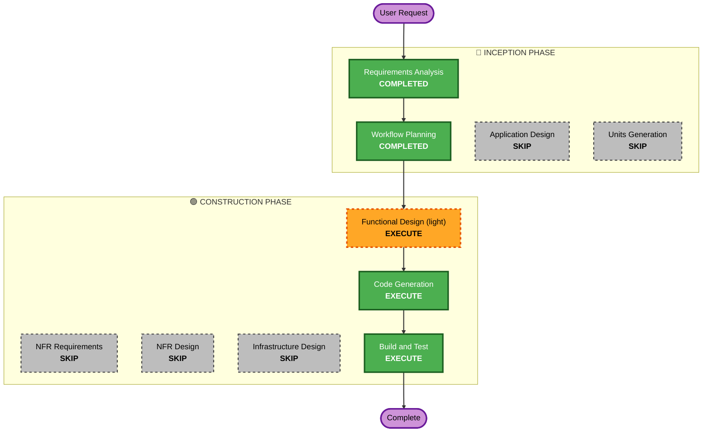

# U6 — `caduceus gateway config` · Execution Plan

## Detailed Analysis Summary

### Transformation Scope (Brownfield)
- **Transformation Type**: Single feature within existing component boundaries (no new components/services).
- **Primary Changes**: New `gateway config` CLI subcommand (view/set `upstream_base_url`, `default_model`);
  atomic `config.toml` read-modify-write; live hot-apply to the running AI-Gateway via a new
  loopback Control-API endpoint.
- **Related Components**: `cli/app.py`, `cli/client.py`, `cli/render.py`, `common/settings.py`,
  `daemon/control_api.py`, `daemon/wiring.py`, AI-Gateway upstream/routing seam
  (`aigateway/upstream.py`, `aigateway/routing.py`).

### Change Impact Assessment
- **User-facing changes**: Yes — new CLI command + output.
- **Structural changes**: No — reuses existing daemon/CLI/settings architecture.
- **Data model changes**: No — operates on existing `Settings` fields and `config.toml`.
- **API changes**: Minor additive — one new loopback Control-API route (e.g. `GET`/`POST /gateway/config`); no breaking changes.
- **NFR impact**: Inherited only — atomic write (Resiliency) + property tests (PBT). No new NFR class.

### Component Relationships
- **Primary Component**: `cli` + `common/settings.py`.
- **Dependent Components**: `daemon/control_api.py` (new route), `daemon/wiring.py` (live-apply seam to UpstreamClient/routing).
- **Shared Components**: `Settings` (read/write), `config.toml`.
- **Supporting Components**: `cli/render.py` (output/exit codes).

### Risk Assessment
- **Risk Level**: Low–Medium (only non-trivial part: mutating live `UpstreamClient`/routing state without restart while preserving in-flight request safety).
- **Rollback Complexity**: Easy (additive command + route; revertable).
- **Testing Complexity**: Simple–Moderate (pure validation/round-trip unit+PBT; live HTTP path → Build & Test).

## Workflow Visualization

## Phases to Execute

### 🔵 INCEPTION PHASE
- [x] Workspace Detection (COMPLETED — brownfield, existing package)
- [x] Reverse Engineering (SKIPPED — system already known / built by this workflow)
- [x] Requirements Analysis (COMPLETED & APPROVED)
- [x] User Stories (SKIPPED — single persona, requirements clear)
- [x] Workflow Planning (IN PROGRESS → this document)
- [ ] Application Design — **SKIP**
  - **Rationale**: No new components or services; changes live within existing component boundaries.
- [ ] Units Generation — **SKIP**
  - **Rationale**: Single small feature; no decomposition needed.

### 🟢 CONSTRUCTION PHASE
- [ ] Functional Design (light) — **EXECUTE**
  - **Rationale**: Capture business rules for the live hot-apply seam, atomic config write,
    URL validation, the Control-API contract, and PBT targets — small but worth pinning down before code.
- [ ] NFR Requirements — **SKIP**
  - **Rationale**: Inherits U1–U4 project-wide NFRs; no new performance/security/scalability class.
- [ ] NFR Design — **SKIP**
  - **Rationale**: NFR Requirements skipped; Resiliency/PBT patterns already established.
- [ ] Infrastructure Design — **SKIP**
  - **Rationale**: No new ports, images, binds, or deployment changes (reuses Control API loopback).
- [ ] Code Generation — **EXECUTE (ALWAYS)**
  - **Rationale**: Implement the command, settings write, validation, route, and live-apply seam + tests.
- [ ] Build and Test — **EXECUTE (ALWAYS)**
  - **Rationale**: Run unit + PBT suite; verify live hot-apply against a running daemon.

### 🟡 OPERATIONS PHASE
- [ ] Operations — PLACEHOLDER

## Package Change Sequence (Brownfield)
Single package (`caduceus`). No multi-module coordination required.

## Estimated Timeline
- **Stages to run**: 3 (Functional Design light → Code Generation → Build & Test), each an approval gate.

## Success Criteria
- **Primary Goal**: `caduceus gateway config` can view and change `upstream_base_url` / `default_model`,
  persisting atomically and hot-applying to a running daemon without restart.
- **Key Deliverables**: CLI subcommand, settings atomic-write + validation, Control-API route, live-apply seam, unit + property tests, README update.
- **Quality Gates**: All existing tests still pass + new tests pass; live hot-apply verified in Build & Test; Resiliency (atomic write) + PBT rules satisfied.
