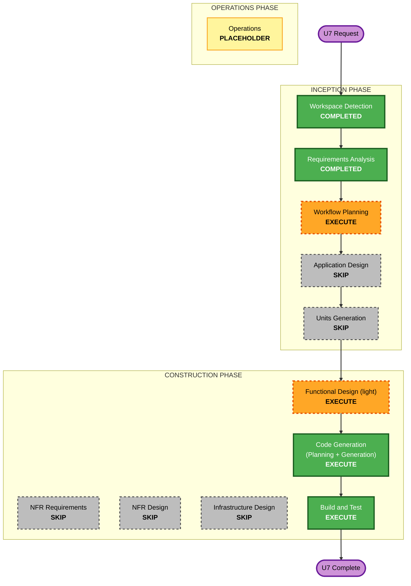

# U7 — Performance & Stability — Execution Plan

## Detailed Analysis Summary

### Transformation Scope (Brownfield)
- **Transformation Type**: Single-system behavioral change across existing components (no new
  services, no new deployment model). Refactor + enhancement + bug fix.
- **Primary Changes**:
  1. `AgentService.list` — single batched `sbx ls` snapshot reused for lifecycle reconcile **and**
     shallow health (FR-U7-1, FR-U7-6).
  2. Background async provisioning saga with a live `creating → running → healthy | failed` state
     machine (FR-U7-2, FR-U7-5-fail).
  3. Chat-ready ACP warm-up (no LLM spend) that seeds the ChatService pool (FR-U7-3, FR-U7-4).
  4. Decouple daemon shutdown from sandbox lifecycle + boot-time reconcile/reconnect from `sbx ls`
     (FR-U7-5).
- **Related Components**: `agents/{service,health,provisioner}.py`, `transport/{chat,supervisor}.py`,
  `daemon/{gateway,wiring,control_api}.py`, `cli/{app,client}.py`, `common/models.py` (health
  `detail` surfacing only).

### Change Impact Assessment
- **User-facing changes**: **Yes** — `create` returns immediately (+`--wait`); `agent ls` fast &
  accurate; first chat has no cold start; `gateway stop`/`start` no longer disturbs agents.
- **Structural changes**: **Minor** — new background-task orchestration inside the daemon; a health
  snapshot abstraction; boot reconcile hook. No new components/packages.
- **Data model changes**: **No** — `AgentRecord`/`Lifecycle` already carry `creating`/`failed` +
  `last_health.detail`. (Any addition, if needed, stays serialization-compatible via `from_dict`.)
- **API changes**: **Backward-compatible** — `POST /agents` keeps its SSE contract but returns early
  by default; add `wait` param for the blocking path. `GET /agents` semantics unchanged (faster).
- **NFR impact**: **Yes** — performance (O(1) `sbx` calls, non-blocking create, warm first chat) +
  resiliency (fault-isolated background provisioning, graceful shutdown preserving sandboxes).

### Component Relationships (Brownfield)
- **Primary Component**: `caduceus/agents/service.py` (lifecycle orchestration + list).
- **Shared Components**: `common/models.py` (AgentRecord/Lifecycle/HealthStatus — read/write).
- **Dependent Components**: `daemon/control_api.py` (routes), `cli/*` (client + UX), `transport/chat.py`
  (pool warm-up), `transport/supervisor.py` (sweep interplay with `creating`/`failed`),
  `daemon/gateway.py` (shutdown decoupling + boot reconcile), `daemon/wiring.py` (composition seam).
- **Change types**: `agents/service.py` Major; `daemon/gateway.py` + `daemon/wiring.py` Minor–Major;
  `transport/chat.py`, `agents/health.py`, `daemon/control_api.py`, `cli/*` Minor.

### Risk Assessment
- **Risk Level**: **Medium** — the async state machine, shutdown decoupling, and boot reconcile touch
  daemon lifecycle + the Supervisor; must preserve existing invariants (fail-fast chat gate, session
  continuity, terminal-event invariant) and all 211 existing tests.
- **Rollback Complexity**: **Moderate** — behavioral (create/shutdown) but largely additive; revert
  by restoring synchronous create + prior list.
- **Testing Complexity**: **Moderate** — unit + PBT for the state machine and snapshot reconcile
  totality; live integration for background create, warm first chat, and gateway stop/start reconnect.

## Workflow Visualization

## Phases to Execute

### 🔵 INCEPTION PHASE
- [x] Workspace Detection (COMPLETED — resume; brownfield, prior U1–U6 + Web UI)
- [x] Reverse Engineering (SKIPPED — artifacts + live code already understood)
- [x] Requirements Analysis (COMPLETED & APPROVED — all answers A)
- [x] User Stories (SKIP — single persona; technical perf/stability change, requirements clear)
- [x] Workflow Planning (IN PROGRESS → this document)
- [ ] Application Design — **SKIP**
  - **Rationale**: No new components/services; all changes stay within existing component boundaries.
- [ ] Units Generation — **SKIP**
  - **Rationale**: Single cohesive unit (U7); no multi-package decomposition.

### 🟢 CONSTRUCTION PHASE
- [ ] Functional Design (light) — **EXECUTE**
  - **Rationale**: There is real new behavior worth pinning down: the async lifecycle state machine
    (`creating→running→healthy|failed`), the single-snapshot reconcile rules, warm-up semantics, and
    shutdown/boot-reconcile invariants — plus PBT targets. Kept light (domain-entities +
    business-logic-model + business-rules), inheriting NFR/Infra from U1–U4 + shared-infrastructure.md.
- [ ] NFR Requirements — **SKIP**
  - **Rationale**: Perf + Resiliency NFRs already captured in requirements; no new tech stack.
- [ ] NFR Design — **SKIP**
  - **Rationale**: NFR Requirements skipped; resiliency patterns (fault isolation, graceful shutdown,
    state durability) applied inline in FD/CodeGen, inheriting U1–U4 decisions.
- [ ] Infrastructure Design — **SKIP**
  - **Rationale**: No infra changes; inherits ports/binds/paths from shared-infrastructure.md.
- [ ] Code Generation — **EXECUTE (ALWAYS)**
  - **Rationale**: Implementation of all FRs + unit/PBT tests.
- [ ] Build and Test — **EXECUTE (ALWAYS)**
  - **Rationale**: Full suite + live integration (background create, warm first chat, `agent ls`
    speed, gateway stop/start reconnect).

### 🟡 OPERATIONS PHASE
- [ ] Operations — PLACEHOLDER

## Module Update Strategy
- **Update Approach**: Sequential within one unit; no cross-package ordering needed.
- **Critical Path**: `agents/service.py` (list snapshot + async saga) → `transport/chat.py` (warm-up
  pool) → `daemon/gateway.py`/`wiring.py` (shutdown decouple + boot reconcile) → `control_api.py`/`cli`.
- **Coordination Points**: `AgentRecord`/`Lifecycle` contract (serialization-compatible); Supervisor
  sweep must tolerate `creating`/`failed`; ChatService pool ownership of warmed transports.
- **Testing Checkpoints**: unit+PBT after CodeGen; live integration in Build & Test.

## Estimated Timeline
- **Total Stages to Execute**: 3 (Functional Design light, Code Generation, Build & Test).
- **Estimated Duration**: 1 focused working session (design + code + test), gated per stage.

## Success Criteria
- **Primary Goal**: Faster, non-blocking, correctly-reported agent lifecycle with a daemon decoupled
  from sandbox lifecycle.
- **Key Deliverables**: single-snapshot fast `agent ls`; background create with live state + `--wait`;
  chat-ready warm-up; gateway stop/start reconnect; correct status + failure surfacing; new tests.
- **Quality Gates**: all existing 211 tests still pass; new unit + PBT for the state machine &
  reconcile; live integration verifies each FR; no LLM spend on health/warm-up.
- **Integration Testing**: create → `agent ls` live progression → warm first chat; `gateway stop`
  then `start` leaves agents running & immediately chat-able.
