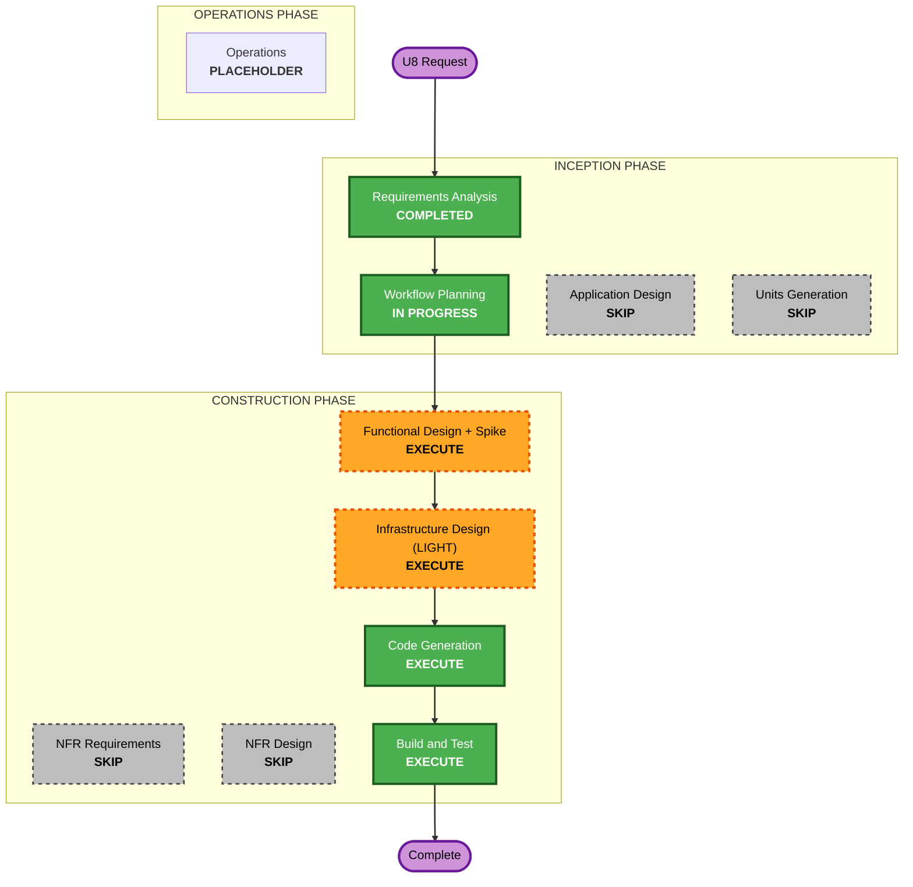

# U8 — HTTP/SSE Transport + Docker Runtime Migration — Execution Plan

## Detailed Analysis Summary

### Transformation Scope (Brownfield)
- **Transformation Type**: **Architectural + Infrastructure** (deployment-model change).
  - **Runtime**: Docker Sandboxes (`sbx`, microVM) → **plain Docker containers** (`runc`
    default, optional `runsc`/gVisor).
  - **Protocol**: `hermes acp` (stdio over `sbx exec`) + `hermes serve` (JSON-RPC/WS) →
    **one hermes API server** client (HTTP + SSE).
- **Primary Changes**: unified `HermesApiTransport`; `DockerProvisioner`; docker-only image
  build; HTTP `/health`; real-time (no-cache) `agent ls`; optional gVisor runtime;
  `caduceus doctor`; `gateway config --runtime`.
- **Related Components**: transport (base/acp/serve/chat/supervisor/events), agents
  (provisioner/images/health/service/hermes_config), common (models/settings),
  config (gateway_config), daemon (wiring/control_api/gateway), cli (app/client/render),
  webui (history), `images/hermes/Dockerfile`.

### Change Impact Assessment
- **User-facing changes**: **Yes** — new `caduceus doctor`; `gateway config --runtime`;
  same chat/ls/Web-UI UX otherwise (transport swapped underneath).
- **Structural changes**: **Yes** — transport branch collapses to one; provisioner backend
  swapped; `AgentRecord` fields re-shaped for the Docker model.
- **Data model changes**: **Yes (light)** — `AgentRecord`: drop `serve_port`/`serve_auth`
  (and sbx-era fields), add Docker fields (e.g. `host_port`, `container_name`); no persisted
  legacy state to migrate (greenfield runtime).
- **API changes**: **Internal** — transport port stays (`Transport` contract preserved);
  Control API gains `doctor`/`config --runtime` surfaces; agent-facing = hermes API server.
- **NFR impact**: **Yes** — new inbound network trust boundary (loopback + bearer);
  optional stronger isolation (`runsc`); real-time health path; timeouts on HTTP/SSE.

### Component Relationships (Brownfield)
- **Primary**: `caduceus/transport/*`, `caduceus/agents/*`.
- **Shared**: `common/models.py` (AgentRecord reshape), `common/settings.py` (runtime key).
- **Dependent**: `daemon/*` (wiring/control_api/gateway), `cli/*`, `webui` (history).
- **Supporting**: `images/hermes/Dockerfile`, README, tests (unit + PBT + integration).

Change types: transport/provisioner/images = **Major**; models/settings/wiring/control_api/
cli = **Minor**; webui history = **Minor**; Dockerfile = **Major** (server entrypoint).

### Risk Assessment
- **Risk Level**: **High** — architectural transformation (runtime + protocol swap) touching
  most modules; must preserve terminal-event invariant, warm-up, boot-reconnect, gateway/agent
  lifecycle decoupling, and the full test suite. hermes API endpoint/SSE shapes are not yet
  empirically confirmed → **spike required** (mirrors the U3 ACP discovery).
- **Rollback Complexity**: **Moderate** — additive-then-cutover in one cycle; git revert
  restores the working sbx/ACP stack, but this replaces working code.
- **Testing Complexity**: **Complex** — fake HTTP/SSE hermes server + fake Docker provisioner
  for unit/PBT (run without Docker); real Docker + hermes API server + Ollama in Build & Test.

## Workflow Visualization



### Text Alternative
```
INCEPTION
- Requirements Analysis ....... COMPLETED
- Workflow Planning ........... IN PROGRESS
- Application Design .......... SKIP
- Units Generation ........... SKIP
CONSTRUCTION
- Functional Design + Spike ... EXECUTE
- NFR Requirements ............ SKIP
- NFR Design ................. SKIP
- Infrastructure Design (LIGHT) EXECUTE
- Code Generation ............ EXECUTE
- Build and Test ............. EXECUTE
OPERATIONS
- Operations ................. PLACEHOLDER
```

## Phases to Execute

### 🔵 INCEPTION PHASE
- [x] Workspace Detection (COMPLETED, prior)
- [x] Reverse Engineering (SKIPPED — greenfield origin; codebase already known)
- [x] Requirements Analysis (COMPLETED & APPROVED)
- [x] User Stories (SKIP — single persona; requirements comprehensive)
- [x] Workflow Planning (IN PROGRESS)
- [ ] Application Design — **SKIP**
  - **Rationale**: Changes live **behind existing component boundaries/ports**
    (`Transport`, `Provisioner`, `HealthChecker`, `ChatService`). New classes
    (`HermesApiTransport`, `DockerProvisioner`, `caduceus doctor`) are new *implementations*
    of established seams, not new architecture. Component design is stable from U1–U4.
- [ ] Units Generation — **SKIP**
  - **Rationale**: Single cohesive re-platforming cycle; no decomposition into new units.

### 🟢 CONSTRUCTION PHASE
- [ ] Functional Design (+ **Spike**) — **EXECUTE** (standard depth)
  - **Rationale**: Core design work — confirm hermes API server shapes via a **spike**
    (session vs run composition, SSE event names, run-id surfacing for stop, `/health`,
    `/messages`); design `HermesApiTransport` + SSE→`ChatEvent` mapping (preserving terminal
    invariant + U5 thinking/tool `meta`), `DockerProvisioner` state machine, HTTP health,
    real-time no-cache `ls`, runtime selection (runc/runsc + fail-fast), `caduceus doctor`,
    `AgentRecord` reshape, and remote-agent unification. Enforce Security(advisory)/
    Resiliency(full)/PBT(full) inline.
- [ ] NFR Requirements — **SKIP**
  - **Rationale**: Cross-cutting NFRs already set in U1 and captured in the U8 requirements
    doc (Perf/Security-advisory/Resiliency/Testability). No new NFR elicitation needed.
- [ ] NFR Design — **SKIP**
  - **Rationale**: NFR patterns (timeouts, supervisor/circuit-breaker, redaction, fail-closed)
    already designed in U1/U3; reused and adapted inline in FD/Infra.
- [ ] Infrastructure Design (LIGHT) — **EXECUTE**
  - **Rationale**: This cycle **changes the deployment/network model** (sbx→docker, inbound
    loopback port publish, bridge outbound, optional `runsc`). Update
    `shared-infrastructure.md`: container run spec, port allocation strategy, network trust
    boundary, runtime selection + gVisor prerequisite, health/lifecycle over Docker. Kept
    LIGHT (personal local tool; no cloud IaC).
- [ ] Code Generation — **EXECUTE (ALWAYS)**
  - **Rationale**: Plan + implement the migration across all touched modules; update tests.
- [ ] Build and Test — **EXECUTE (ALWAYS)**
  - **Rationale**: Full unit+PBT green without Docker; live integration on real
    Docker + hermes API server + Ollama (chat/stream, stop, history, health, warm-up,
    boot-reconnect, runc + optionally runsc).

### 🟡 OPERATIONS PHASE
- [ ] Operations — PLACEHOLDER

## Critical Path (implementation order)
1. **Spike** (confirm hermes API server behavior) — de-risks everything downstream.
2. `common/models.py` (AgentRecord reshape) + `common/settings.py` (`container_runtime`).
3. `transport/events.py` (SSE event set) + new `transport/hermes_api.py` (`HermesApiTransport`);
   retire `acp.py`/`serve.py`; simplify `transport/base.py` `for_agent`.
4. `agents/provisioner.py` (`DockerProvisioner`) + `agents/images.py` (docker-only) +
   `agents/health.py` (HTTP `/health`) + `agents/hermes_config.py` (API-server env).
5. `agents/service.py` (real-time no-cache list; create saga; warm-up) +
   `transport/chat.py` + `transport/supervisor.py` (auto-restart only).
6. `daemon/wiring.py` + `daemon/control_api.py` (+ `doctor`) + `daemon/gateway.py`
   (boot-reconnect from docker) + `config/gateway_config.py` (`--runtime`).
7. `cli/{app,client,render}.py` (`doctor`, `--runtime`) + `webui` history via `/messages`.
8. Tests (fakes: HTTP/SSE server + docker) → Build & Test integration.

## Success Criteria
- **Primary Goal**: Local & remote agents driven over a single HTTP/SSE hermes-API-server
  transport; agents run in plain Docker containers; `sbx`/ACP/serve removed.
- **Key Deliverables**: `HermesApiTransport`, `DockerProvisioner`, docker-only image build,
  HTTP health + real-time `ls`, optional `runsc` runtime, `caduceus doctor`,
  `gateway config --runtime`, updated docs; all tests green + live-verified.
- **Quality Gates**: terminal-event invariant preserved; full existing suite passes (adapted);
  new PBT (mapping totality, runtime-selection totality, provisioner state machine); live
  integration (chat/stream/stop/history/health, warm-up, boot-reconnect) on runc (+ runsc if
  available); Security advisory findings surfaced (non-blocking).
- **Integration Testing**: real Docker + hermes API server + Ollama end-to-end.

## Estimated Timeline
- **Stages to Execute**: 4 (Functional Design + Spike, Infrastructure Design LIGHT,
  Code Generation, Build & Test).
- **Stages to Skip**: 4 (Application Design, Units Generation, NFR Requirements, NFR Design).
- **Relative effort**: Larger than U5–U7 (cross-cutting), single unit, sequential.
