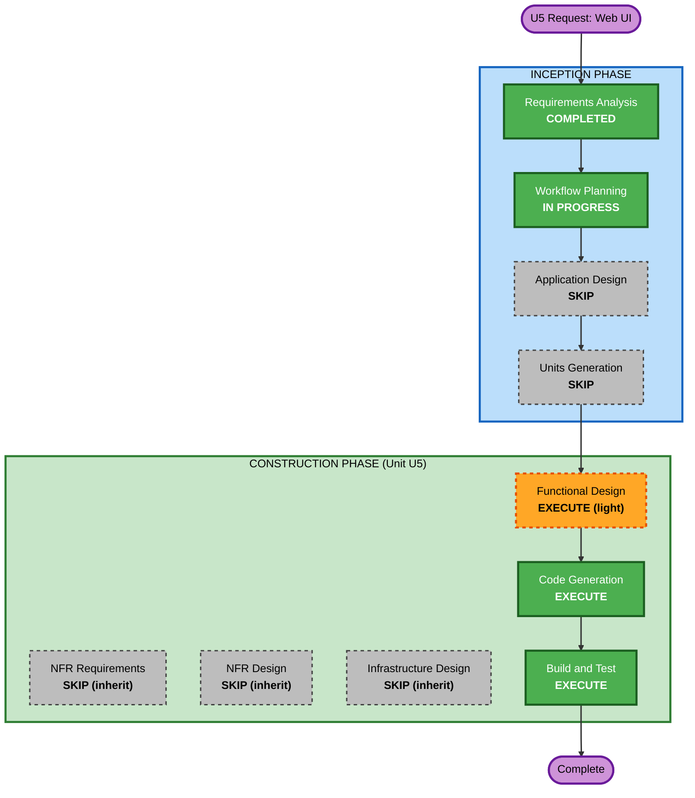

# Execution Plan — U5 Gateway Web UI

## Detailed Analysis Summary

### Transformation Scope (Brownfield)
- **Transformation Type**: Single new component (`caduceus/webui`) + a focused extension of an existing component (chat event model / ACP transport in U3).
- **Primary Changes**:
  1. New static SPA assets + a thin web-serving surface mounted on the **existing** Control API app (no new listener/port).
  2. **Cross-cutting enabler** — extend `ChatEvent` (`transport/events.py`) and `AcpTransport` (`transport/acp.py`) to surface **thinking** + **tool-call** events currently discarded.
  3. Best-effort chat-history load via ACP `session/load` replay.
- **Related Components**: U4 daemon (control_api.py — mount UI + relay new events), U3 transport (events/acp/chat), U2 AgentView projection (reused, secret-free).

### Change Impact Assessment
- **User-facing changes**: Yes — a new browser UI (dashboard + add agent + streaming chat).
- **Structural changes**: Minor — one new package `caduceus/webui`; Control API gains static mount + (small) UI-support routes.
- **Data model changes**: Yes (additive) — new `ChatEvent` variants (thinking / tool_call / tool_result). No persisted-schema change.
- **API changes**: Additive — chat SSE carries new event types (backward-compatible); existing endpoints reused unchanged. Possibly one new read endpoint for history load.
- **NFR impact**: Loopback-only, no auth; no new perf/scale/infra. Inherits Resiliency (full) + PBT (full).

### Component Relationships
- **Primary Component**: `caduceus/webui` (new) — static assets + serving.
- **Modified Components**: `caduceus/transport/events.py`, `caduceus/transport/acp.py`, `caduceus/daemon/control_api.py`.
- **Reused (unchanged)**: `agent_service`, `chat_service`, `registry`, `AgentView`, provisioning SSE, AI-Gateway.
- **Dependent Components**: CLI chat renderer (`cli/render.py`) — must remain compatible with new (additive) event types.

### Risk Assessment
- **Risk Level**: **Low–Medium**. Frontend is isolated/low-risk. The real risk is the cross-cutting change to the **tested** U3 event path: must preserve the **terminal-event invariant** (exactly one `done`/`error`; nothing after) and **CLI backward-compatibility**.
- **Rollback Complexity**: Easy — changes are additive; new module is removable; event additions are opt-in.
- **Testing Complexity**: Moderate — event-model extension gets unit + PBT (fake ACP agent, no Docker); UI validated by live browser integration.

## Workflow Visualization

## Phases to Execute

### 🔵 INCEPTION PHASE
- [x] Workspace Detection (COMPLETED — brownfield, resumed)
- [x] Reverse Engineering (SKIPPED — code authored by this project; architecture known from prior cycle)
- [x] Requirements Analysis (COMPLETED & APPROVED)
- [x] User Stories (SKIPPED — single persona; requirements clear)
- [x] Workflow Planning (IN PROGRESS)
- [ ] Application Design — **SKIP**
  - **Rationale**: One small new component mounted on the already-designed Control API; no new service layer. Minimal component definition folded into Functional Design.
- [ ] Units Generation — **SKIP**
  - **Rationale**: Single unit (U5). No decomposition needed.

### 🟢 CONSTRUCTION PHASE (Unit U5)
- [ ] Functional Design — **EXECUTE (light)**
  - **Rationale**: FR-W9 introduces new chat event types + ACP `session/update`→event mapping under the terminal-event invariant, plus history-replay semantics and the web surface contract. This is the design-worthy core.
- [ ] NFR Requirements — **SKIP (inherit)**
  - **Rationale**: No new perf/scale; security posture (loopback/no-auth) already decided; inherits U1–U4 NFR + Resiliency scope.
- [ ] NFR Design — **SKIP (inherit)**
  - **Rationale**: Follows NFR-Requirements skip; resiliency behaviors (graceful errors, fail-fast, SSE disconnect handling) captured as business rules in Functional Design.
- [ ] Infrastructure Design — **SKIP (inherit)**
  - **Rationale**: No new port/container/cloud resource. Static assets packaged into the existing wheel (shared-infrastructure.md unchanged).
- [ ] Code Generation — **EXECUTE (ALWAYS)**
  - **Rationale**: Implement the SPA, the event-model + ACP extension, control_api mount, and tests.
- [ ] Build and Test — **EXECUTE (ALWAYS)**
  - **Rationale**: Unit + PBT for the event extension (fake ACP agent); live browser integration (dashboard, provision, streaming chat w/ thinking+tool, history load); CLI regression.

### 🟡 OPERATIONS PHASE
- [ ] Operations — PLACEHOLDER

## Extension Configuration (inherited)
- Security Baseline: **No** (loopback personal tool).
- Resiliency Baseline: **Yes / full** — enforced where applicable to U5 (graceful degradation, health/lifecycle accuracy, logging).
- Property-Based Testing: **Yes / full** — applied to the event-model extension (terminal-invariant property; ACP-update→event translation).

## Estimated Timeline
- **Total stages to execute**: 3 (Functional Design → Code Generation → Build & Test).
- **Estimated duration**: short — most UI capability reuses existing endpoints; main effort is the event-model extension + static SPA.

## Success Criteria
- **Primary Goal**: `caduceus gateway` serves a loopback Web UI providing dashboard, local-provision + remote-register agent add (live status), and streaming chat with **thinking + tool-call** display and best-effort history load.
- **Key Deliverables**: `caduceus/webui/` (static SPA + serving), extended `ChatEvent` + `AcpTransport`, control_api mount, tests (unit + PBT), packaging update.
- **Quality Gates**: existing test suite stays green (no CLI regression); terminal-event invariant holds under new event set (PBT); live browser flow verified end-to-end against a real local sbx agent.
