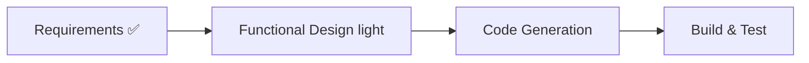

# U11 — Agent Dashboard Routing — Execution Plan

## Scope & Impact (from approved requirements)

- **Type**: Additive enhancement, brownfield. 신규 메커니즘 = Control API의 리버스 프록시
  (HTTP/SSE) + **WebSocket 브리지**; 나머지는 기존 패턴 확장.
- **Touched components**:
  - `caduceus/common/models.py` — `AgentRecord.dashboard_port/dashboard_password(secret)`,
    `AgentView.dashboard` (Q3: 구 스키마 tolerant-read 없음).
  - `caduceus/agents/provisioner.py` — dashboard env 3종 + 두 번째 포트 퍼블리시
    (`-p 127.0.0.1::9119`), start 후 dashboard host port 읽기 (`docker port <c> 9119`).
  - `caduceus/agents/service.py` — create saga에 password 발급/env 조립/포트 기록,
    `--no-dashboard` 경로.
  - `caduceus/daemon/control_api.py` — 프록시 라우트(`/agents/{name}/dashboard[/{path}]`),
    WS 브리지, `GET /agents/{name}/dashboard-credentials`.
  - `caduceus/cli/{app,client,render}.py` — `agent create --no-dashboard`,
    `agent dashboard-cred <name>` (+`--json`).
  - `caduceus/webui/assets/*` — agent card 링크 + 자격증명 복사 액션.
  - `construction/shared-infrastructure.md` — 포트 표에 dashboard 퍼블리시 추가 (FD에서 갱신).
- **Dependencies**: httpx(기존)로 스트리밍 프록시; WS 브리지는 표준 `websockets` 또는
  Starlette WebSocket + httpx-ws 계열 — **신규 런타임 의존성 필요 여부는 FD에서 결정**
  (U8에서 websockets 의존성을 제거했으므로 재도입은 명시적 결정 사항).
- **Data model impact**: state.json의 AgentRecord 형태 변화 (clean env — 마이그레이션 없음).
- **Security 경계**: 노출 = Control API 127.0.0.1:9700 그대로; 인증 = hermes auth gate 위임;
  secret 취급 advisory 항목 2건 (env의 docker inspect 노출, password state.json 저장).

## Stages

### EXECUTE
1. **Functional Design (light)** — 프록시/브리지 상세 (URL 결합·헤더 필터 규칙, WS 의존성
   결정, 스트리밍-shutdown 상호작용), create saga 확장, BR/PBT 명세,
   shared-infrastructure.md 갱신. 별도 질문 라운드 없이 inline 결정 (요구사항이 구체적).
2. **Code Generation** (Part 1 plan → Part 2 generation) — 표준 2-option 게이트.
3. **Build & Test** — 유닛+PBT 전체 그린 + 라이브 통합 (실 컨테이너로 dashboard 기동,
   프록시 경유 로그인/페이지/WS, Web UI 링크, 자격증명 CLI/route, graceful shutdown).

### SKIP (사유)
- **Application Design / Units Generation** — 단일 소형 유닛, 기존 컴포넌트 경계 내.
- **NFR Requirements / NFR Design** — U1/U3 cross-cutting 상속; U11 NFR은 요구사항에 명시됨.
- **Infrastructure Design** — 배포 모델 변화가 포트 1개 추가 수준; FD에서
  shared-infrastructure.md 갱신으로 흡수.
- **User Stories** — 단일 페르소나, 요구사항 명확.

## Risk / Rollback / Testing
- **Risk: Medium** — WS 브리지가 신규 메커니즘 (프레임 중계, 종료 전파, shutdown 상호작용);
  프록시 무기한 스트림이 U10-L1의 graceful-shutdown 개선과 충돌하지 않아야 함;
  provisioner create saga 변경은 U8-D3(포트는 start 후 확정) 경로를 다시 지남.
- **Rollback: Easy** — 순수 additive; 프록시/브리지 라우트 제거로 원복 (단 state.json에
  새 필드가 남는 것은 무해).
- **Testing: Moderate** — 유닛(프록시 헤더/URL/오류 시맨틱, saga, secret 비노출) +
  PBT-U11-1..3 + 라이브 통합(WS 포함) + Playwright e2e(카드 링크).

## Extension Compliance (this cycle)
- **Security Baseline (advisory/non-blocking)**: FD/CodeGen에서 advisory 항목 표기
  (env 노출, secret 저장, 노출 경계) — 차단 없음.
- **Resiliency (full, blocking)**: NFR-U11-2 (fault isolation, shutdown-safe, 유한 connect
  timeout, dashboard-down ≠ agent unhealthy) — Build & Test에서 검증.
- **PBT (full, blocking)**: PBT-U11-1..3 구현 필수.

## Workflow

